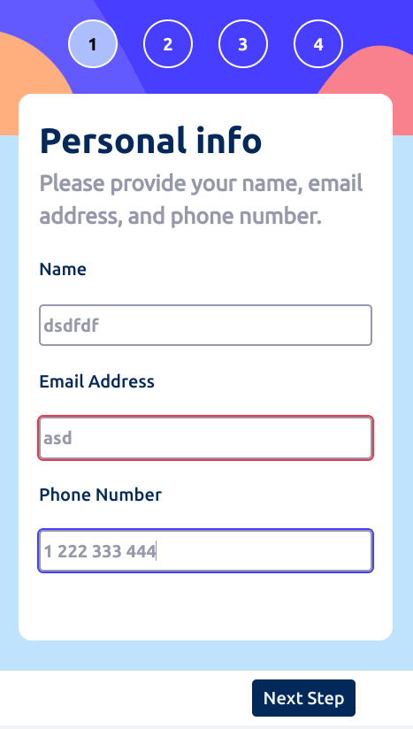

# Frontend Mentor - Multi-step form solution

This is a solution to the [Multi-step form challenge on Frontend Mentor](https://www.frontendmentor.io/challenges/multistep-form-YVAnSdqQBJ).Frontend Mentor challenges help you improve your coding skills by building realistic projects. 

## Table of contents

- [Overview](#overview)
  - [The challenge](#the-challenge)
  - [Screenshot](#screenshot)
  - [Links](#links)
- [My process](#my-process)
  - [Built with](#built-with)
  - [What I learned](#what-i-learned)
  - [Continued development](#continued-development)
  - [Useful resources](#useful-resources)

## Overview

### The challenge

Users should be able to:

- Complete each step of the sequence
- See a summary of their selections on the final step and confirm their order
- View the optimal layout for the interface depending on their device's screen size
- See hover and focus states for all interactive elements on the page

### Screenshot




### Links

- Live Site URL: [Github Pages](https://jdegand.github.io/multi-step-form)

## My process

### Built with

- Semantic HTML5 markup
- CSS custom properties
- Flexbox
- CSS Grid
- Mobile-first workflow
- JS

### What I learned

Numerous inconsistencies in the design files.

Tables are a pain to style.

Hiding the radio button for a clickable tile design creates accessibility problems.  

Didn't add an extra 'This is required' error message.  

Need a better message explaining the telephone pattern.  

Using divs inside a ul creates invalid html (see below) -  better to use multiple uls to group items together for styling purposes ? 

```html
      <nav>
        <ul>
          <li class="step-number fill">
            <div>
              <div class="step-number-circle">1</div>
              <div class="mobile-hide">
                <ul>
                  <li>Step 1</li>
                  <li>Your Info</li>
                </ul>
              </div>
            </div>
          </li>
          <li class="step-number">
            <div>
              <div class="step-number-circle">2</div>
              <div class="mobile-hide">
                <ul>
                  <li>Step 2</li>
                  <li>Select plan</li>
                </ul>
              </div>
            </div>
          </li>
          <li class="step-number">
            <div>
              <div class="step-number-circle">3</div>
              <div class="mobile-hide">
                <ul>
                  <li>Step 3</li>
                  <li>Add-ons</li>
                </ul>
              </div>
            </div>
          </li>
          <li class="step-number">
            <div>
              <div class="step-number-circle">4</div>
              <div class="mobile-hide">
                <ul>
                  <li>Step 4</li>
                  <li>Summary</li>
                </ul>
              </div>
            </div>
          </li>
        </ul>
      </nav>  
```

### Continued development

- Accessibility - toggle, radio, checkbox inputs 
- Better Semantics
- JS refactor for better performance - using best selector at all times - which selectors should be global and which can be inside functions
- Dynamically create a table for total
- Disable buttons if no valid input - or allow movement to other steps and then prevent submitting until all inputs have valid input.
- Make formData object on submit to send to api
- should tab numbers be clickable and allow user to go to that step
- fallback for :has selector styling
- Tweaks for more viewport sizes

### Useful resources

- [Josh Comeau](https://www.joshwcomeau.com/css/custom-css-reset/) - css reset
- [SpaceBro](https://spacebro.io/articles/crate-multistep-form-vanilla-js) - Multistep form vanilla js
- [CodePen](https://codepen.io/im1tta/pen/QGmYmN) - multistep form
- [YouTube](https://www.youtube.com/watch?v=cKTgIDkRsGc) - multistep form
- [W3 Schools](https://www.w3schools.com/howto/howto_js_form_steps.asp) - multistep form
- [Medium](https://levelup.gitconnected.com/create-a-multi-step-form-using-html-css-and-javascript-30aca5c062fc) - multistep form
- [a11y](https://www.a11yproject.com/posts/how-to-write-accessible-forms/) - accessible forms
- [Kwes Forms](https://kwesforms.com/docs/v2/multistep-forms) - multistep forms
- [Github](https://github.com/jensimmons/cssremedy/issues/50) - fieldset's ugly default styling and lack of use 
- [Do Factory](https://www.dofactory.com/html/legend) - table legend 
- [YouTube](https://www.youtube.com/watch?v=8onWWl-k7Gw) - Pop-up & multi-step forms in JavaScript
- [Stack Overflow](https://stackoverflow.com/questions/1915077/is-div-inside-list-allowed) - div inside li
- [W3 Schools](https://www.w3schools.com/howto/howto_css_switch.asp) - toggle switch
- [MockPlus](https://www.mockplus.com/blog/post/radio-button-design) - radio button design
- [YouTube](https://www.youtube.com/watch?v=qDxcQHecxMY) - custom radio buttons but invalid html - labels cannot contain divs
- [Github](https://github.com/calebcadainoo/crosbyroads2021) - custom radio button
- [Html5 tutorial](https://html5-tutorial.net/forms/checkboxes/) - checkboxes
- [Stack Overflow](https://stackoverflow.com/questions/33277777/css-circle-with-border) - css circle with border
- [YouTube](https://www.youtube.com/watch?v=VdqtdKXxKhM&t=565s) - web dev simplified 
- [Stack Overflow](https://stackoverflow.com/questions/18078871/hide-check-radio-button-with-css)
- [Modern CSS Dev](https://moderncss.dev/pure-css-custom-styled-radio-buttons/) - pure css custom styled radio buttons
- [Codepen](https://codepen.io/caseycallow/pen/yaGQMo) - radio button tiles
- [Geeks for Geeks](https://www.geeksforgeeks.org/how-to-get-value-of-selected-radio-button-using-javascript/) - get value of selected radio button
- [Geeks for Geeks](https://www.geeksforgeeks.org/remove-all-the-child-elements-of-a-dom-node-in-javascript/) - remove all child elements of dom node
- [CSS Tricks](https://css-tricks.com/the-css-has-selector/) - :has selector
- [FolksTalk](https://www.folkstalk.com/tech/dynamically-add-remove-rows-in-html-table-using-javascript-with-code-examples/) - remove rows in html table
- [CSS Tricks](https://css-tricks.com/snippets/css/form-validation-styling-on-input-focus/) - form validation styling on input focus
- [Digital Ocean](https://www.digitalocean.com/community/tutorials/css-styling-form-input-validity) - css styling form input validity
- [W3 Schools](https://www.w3schools.com/howto/howto_css_placeholder.asp) - css placeholder
- [Stack Overflow](https://stackoverflow.com/questions/3656615/padding-a-table-row) - padding a table row
- [Stack Overflow](https://stackoverflow.com/questions/22148080/an-invalid-form-control-with-name-is-not-focusable) - invalid form control with name is not focusable